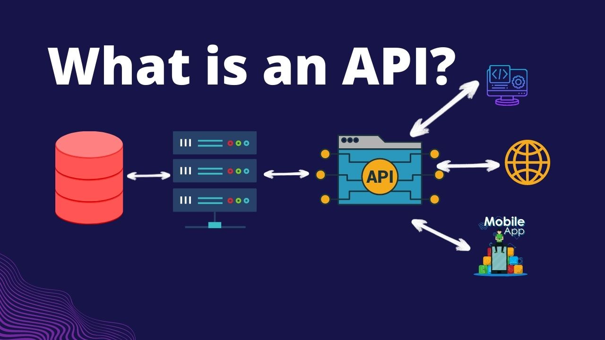

# API

APIs are mechanisms that enable two software components to communicate with each other using a set of definitions and protocols.

API architecture is usually explained in terms of client and server. The application sending the request is called the client, and the application sending the response is called the server. So in the weather example, the bureau’s weather database is the server, and the mobile app is the client. 

There are four different ways that APIs can work depending on when and why they were created.

**SOAP APIs**

These APIs use Simple Object Access Protocol. Client and server exchange messages using XML. This is a less flexible API that was more popular in the past.

**RPC APIs**

These APIs are called Remote Procedure Calls. The client completes a function (or procedure) on the server, and the server sends the output back to the client.

**Websocket APIs**

Websocket API is another modern web API development that uses JSON objects to pass data. A WebSocket API supports two-way communication between client apps and the server. The server can send callback messages to connected clients, making it more efficient than REST API.

**REST APIs**

These are the most popular and flexible APIs found on the web today. The client sends requests to the server as data. The server uses this clie

## REFERENCE

1. [AWS](https://aws.amazon.com/what-is/api/#:~:text=API%20stands%20for%20Application%20Programming,other%20using%20requests%20and%20responses.)
2. [YOUTUBE](https://www.youtube.com/watch?v=GZvSYJDk-us)
